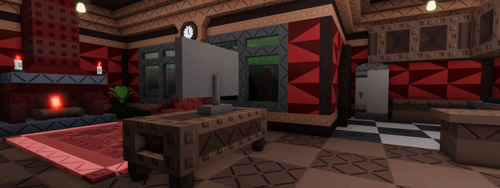
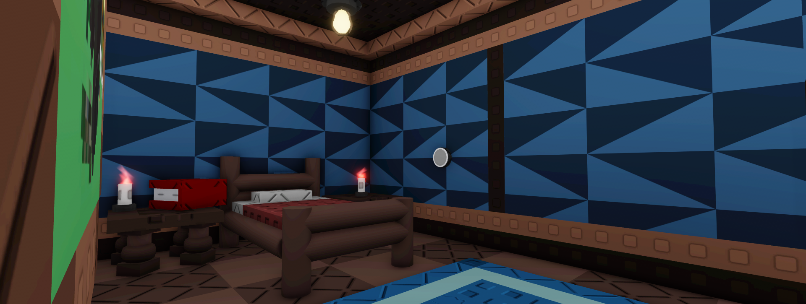
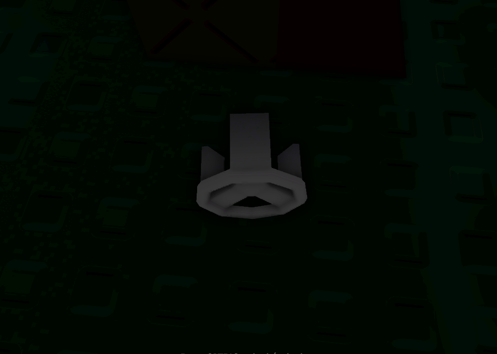

# Humble Abode

Humble Abode is a ⭐⭐ difficulty map and it is the second map you will play on containing 3 rooms Hall/kitchen, bedroom and bathroom&#x20;

<figure><figcaption></figcaption></figure> <figure><figcaption></figcaption></figure>

<figure><figcaption></figcaption></figure>

The Humble Abode location opens to you after completing the first map Hotel room\
\
**Upon solving the crime successfully, you will be rewarded with**:\
\
1\. 20 coins ( _Repeatable_ )\
\
2\. A badge, “[Still In Touch](../Achievements/StillInTouch.md)”\
\
3.A new map, “[Bathroom](Bathroom.md)”
