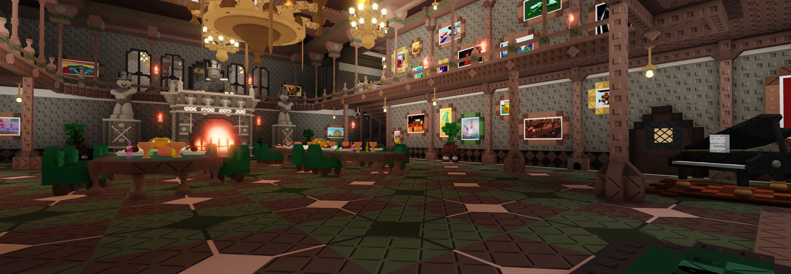
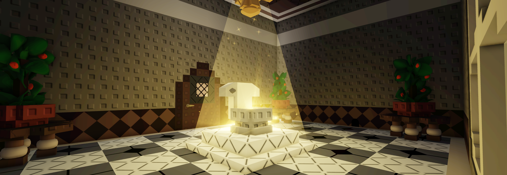

# Moolah Manor

⭐⭐⭐⭐⭐

<figure><figcaption></figcaption></figure> <figure><figcaption></figcaption></figure>

<figure><figcaption></figcaption></figure> <figure><figcaption></figcaption></figure>

&#x20;                                   Holy room                                                                                 Kitchen                                  Moolah Manor is the estate of a wealthy collector, which has 4 rooms and a large hall. This map can be unlocked after completing the first three maps.
\
\
\
1.For completing a level you are given 50 coins.\
\
2.A badge, “[Cha-Ching](../Achievements/Cha-Ching.md)”\
\
3.Nothing.
