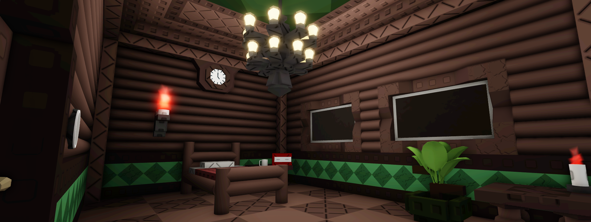
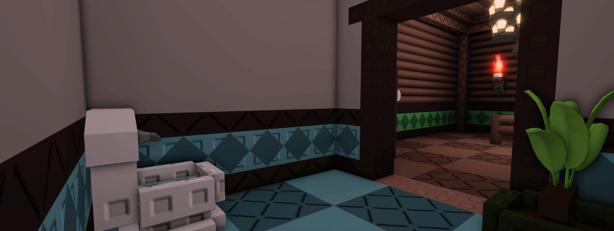

# Motel Room

<figure><figcaption>
BEDROOM
</figcaption></figure> <figure><figcaption>
BATHROOM
</figcaption></figure>

Motel room is a ⭐ difficulty map and the first map you'll be playing that contains two rooms. The Bedroom and the Bathroom.

**Upon solving the crime successfully, you will be rewarded with**:

1. 10 coins ( _Repeatable_ )
2. A badge, “[Armless & Dangerous](../Achievements/Armless\&Dangerous.md)”
3. A new map, “[Humble Adobe](HumbleAbode.md)”\

## BACKSTORY:

Clicking start will begin to play a cutscene of you suddenly losing both of your arms due to an accident that happened to your old workplace, the factory. Your bright smile suddenly disappearing :-(\
\
After getting a new job as a detective, your boss gave you a black fedora that has everything you need to solving the all cases you'll be facing soon.
