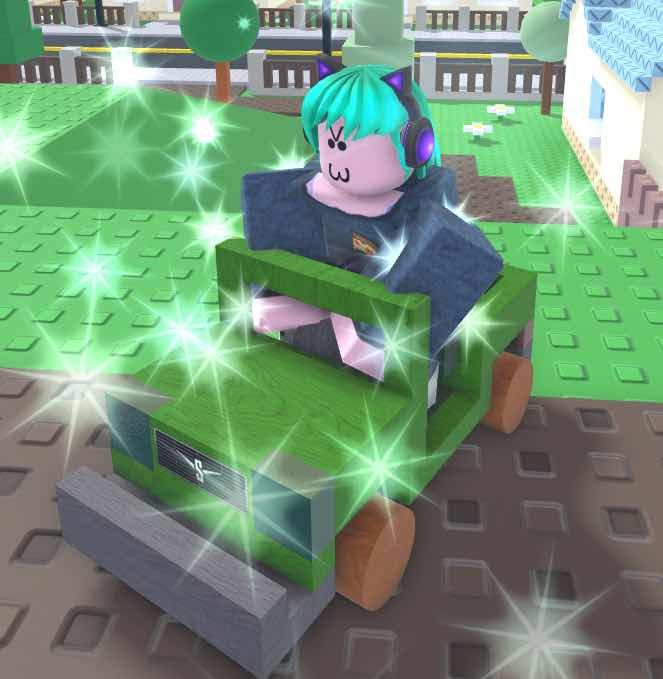

# Sophia

<figure><figcaption></figcaption></figure>



[Eats lots of food](https://armless-detective-wiki-1.gitbook.io/armless-detective-wiki/clues/clues/eatslotsoffood)\
\
[Sheds hair often](https://armless-detective-wiki-1.gitbook.io/armless-detective-wiki/clues/clues/shedshairoftenly)\
\
[Bad at hiding their fingerprints](https://armless-detective-wiki-1.gitbook.io/armless-detective-wiki/clues/clues/badathidingtheirfingerprints)






